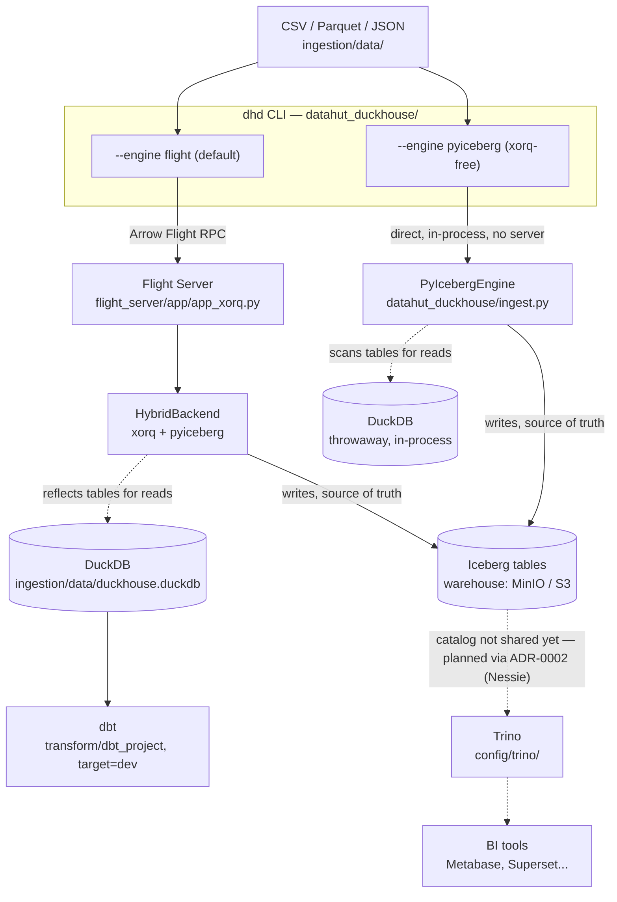

# 🏠 DataHut-DuckHouse

**DataHut-DuckHouse** is a lightweight, hybrid, and open-source analytics platform that combines the simplicity of **DuckDB**, the scalability of **Iceberg**, the speed of **Arrow Flight**, the orchestration power of **Xorq**, and the modularity of **dbt** to create a modern, local or cloud-ready data stack.

## 🧱 Architecture



Two independent ways to get data into Iceberg — the default `flight` engine goes
through the Arrow Flight server (`xorq` + `HybridBackend`); `--engine pyiceberg`
talks to the Iceberg catalog directly, no server, no `xorq` dependency. Both land
in the same MinIO/S3 warehouse. See [Engines](#engines---engine-flight-default-vs---engine-pyiceberg)
below. DuckDB is always a read-side reflection, never the source of truth
(ADR-0001). The Trino leg is scaffolded (`config/trino/`, `docker-compose.yml`)
but **not functional yet** — see [Known gaps](#-known-gaps) and
[ADR-0002](docs/adr/0002-iceberg-catalog-nessie.md).

## ✨ Features

- 🔗 Fast ingestion via Arrow Flight, or serverless straight to Iceberg (`--engine pyiceberg`)
- 🐤 Hybrid storage: Iceberg is the source of truth, DuckDB reflects it for reads
- 🧠 Orchestration with Xorq (Flight + multi-backend support)
- ☁️ S3 integration via MinIO
- 📊 Declarative SQL transformations using dbt (DuckDB `dev` target)
- 🔜 Trino for distributed SQL over Iceberg — scaffolded, not wired yet (needs a shared catalog, ADR-0002)
- 🔜 Multi-tenancy — deliberately deferred until there's a second real user (see [docs/ROADMAP.md](docs/ROADMAP.md))

## ⚙️ Requirements

- [Python 3.11 or 3.12](https://www.python.org/downloads/) (uv can install it for you)
- [uv](https://docs.astral.sh/uv/) — dependency & environment manager
- [Docker](https://www.docker.com/) with the Compose plugin

## 🚀 Installation

### 1. Clone the repository

```bash
git clone https://github.com/Geobatpo07/datahut-duckhouse.git
cd datahut-duckhouse
```

### 2. Install Python dependencies

```bash
uv sync          # creates .venv from uv.lock
```

Run any command inside the environment with `uv run <cmd>` (e.g. `uv run pytest`).

### 3. Configure the environment

```bash
make env         # copies .devcontainer/.env.example -> .env
# then edit .env and set MINIO_ROOT_PASSWORD / AWS_SECRET_ACCESS_KEY
```

`.env` is git-ignored and is the only place secrets live — the Dockerfiles and
`docker-compose.yml` contain none.

> ⚠️ `config/trino/etc/catalog/iceberg.properties` hardcodes the MinIO credentials
> as `minioadmin` / `minioadmin123`. Until that's parameterized, set
> `MINIO_ROOT_PASSWORD` and `AWS_SECRET_ACCESS_KEY` to `minioadmin123` — anything
> else and Trino/MinIO end up with mismatched credentials.

### 4. Launch the full environment

```bash
docker compose up --build      # or: make docker-up
```

Docker build files live in [`.devcontainer/`](.devcontainer/); `docker-compose.yml`
stays at the repo root. VS Code users can also "Reopen in Container" — the
[`.devcontainer/devcontainer.json`](.devcontainer/devcontainer.json) brings up the
same stack as a dev environment.

`minio`, `minio-setup`, `flight-server` and `xorq-admin` build and come up clean.
`trino` does not — see [Known gaps](#-known-gaps).

### 5. Ingest and query with the `dhd` CLI

`dhd` is the single-user client (roadmap Phase 2). By default it drives the Flight
server — start one first (`make dev-server`, or
`uv run python -m flight_server.app.app_xorq`), then in another shell:

```bash
uv run dhd create-table sales data/sales.csv      # .csv / .parquet / .json
uv run dhd list-tables
uv run dhd insert sales data/sales_new.csv          # --mode append|overwrite
```

`dhd` reads `FLIGHT_SERVER_HOST` / `FLIGHT_SERVER_PORT` (default `localhost:8815`).
If the server isn't running it fails with a clear message rather than hanging.
`dhd branch …` is a placeholder until Nessie lands (ADR-0002 / Phase 3).

> ⚠️ **`dhd query` on the default `flight` engine currently crashes** (native
> segfault deserializing the schema xorq sends back over Flight — see
> [Known gaps](#-known-gaps)). `create-table`/`list-tables`/`insert` are fine; for
> `query`, use `--engine pyiceberg` below until it's fixed upstream.

#### Engines: `--engine flight` (default) vs `--engine pyiceberg`

`dhd --engine pyiceberg <cmd>` (or `DHD_ENGINE=pyiceberg`) skips the Flight
server entirely and talks straight to the Iceberg catalog with `pyiceberg` +
`pyarrow` — no server to start, no `xorq` in the path. Reads run through a
throwaway in-process DuckDB that scans the Iceberg tables.

```bash
# local file:// warehouse (default when ICEBERG_WAREHOUSE is unset)
uv run dhd --engine pyiceberg create-table sales data/sales.csv
uv run dhd --engine pyiceberg query "SELECT count(*) FROM sales"

# against MinIO / S3
ICEBERG_WAREHOUSE=s3://duckhouse-warehouse/ \
S3_ENDPOINT=http://localhost:9000 \
AWS_ACCESS_KEY_ID=minioadmin AWS_SECRET_ACCESS_KEY=minioadmin123 \
  uv run dhd --engine pyiceberg create-table sales data/sales.csv
```

It keeps its own SQL catalog file (`ingestion/data/pyiceberg_catalog.db`),
separate from a running Flight server's catalog — fine for the single-user model
(ADR-0001); a shared catalog arrives with Nessie (ADR-0002 / Phase 3). The CLI
does not read `.env` itself, so pass `ICEBERG_*` / `S3_*` / `AWS_*` in the
environment.

## 📂 Project Structure

```
datahut-duckhouse/
├── datahut_duckhouse/    # `dhd` CLI (the only packaged component)
│   ├── cli.py            # click commands, --engine flight|pyiceberg
│   ├── connection.py     # flight engine: connects to the Flight server
│   └── ingest.py         # pyiceberg engine: talks to Iceberg directly, no xorq
├── flight_server/        # Arrow Flight Server + HybridBackend
│   └── app/
│       ├── app_xorq.py
│       ├── xorq_config.py
│       ├── utils.py
│       ├── trino_client.py
│       ├── monitoring.py
│       └── backends/hybrid_backend.py
├── xorq/                 # standalone FastAPI orchestration API (xorq-service)
├── xorq-admin-dashboard/ # React/Vite admin UI, served by nginx (xorq-admin)
├── ingestion/data/       # Source CSV + local duckhouse.duckdb
├── scripts/              # Ingestion, queries, tenant management, dbt runner
│   ├── ingest_flight.py
│   ├── query_duckdb.py
│   ├── query_trino.py
│   ├── setup_iceberg_tables.py
│   ├── create_tenant.py
│   └── delete_tenant.py
├── query_engine/         # unified DuckDB/Trino query-routing prototype
├── transform/dbt_project/ # dbt models (config/profiles.yml, target=dev|prod)
├── config/               # Trino + tenants config
│   ├── trino/etc/
│   └── tenants/tenants.yml
├── tests/                # pytest suite (unit + in-process Flight e2e)
├── docs/
│   ├── adr/              # Architecture Decision Records (0001–0005)
│   └── ROADMAP.md        # phased plan, single source of truth on status
├── .devcontainer/        # Dockerfiles + devcontainer.json + .env.example
├── .env                  # Secrets & config (git-ignored; from .devcontainer/.env.example)
├── docker-compose.yml    # Stack definition (root; no secrets)
├── uv.lock
└── pyproject.toml
```

## 🧠 Using dbt with DuckDB

```bash
cd transform/dbt_project
uv run dbt deps                                    # installs dbt_utils (packages.yml)
uv run dbt run  --profiles-dir config --target dev
uv run dbt test --profiles-dir config --target dev  # a few tests still fail, see Known gaps
```

## 🔎 Example Local Query

```bash
uv run python scripts/query_duckdb.py
```

## 🔒 Delete a Tenant

```bash
uv run python scripts/delete_tenant.py --id tenant_acme
```

`create_tenant.py`/`delete_tenant.py` exist as standalone scripts, but there is no
tenant concept in `dhd` or `HybridBackend` yet — multi-tenancy is deliberately
deferred (see [docs/ROADMAP.md](docs/ROADMAP.md)).

## 📈 BI Interface with Trino

**Not functional yet.** `trino` currently fails to start (config in
`config/trino/etc/` predates Trino 483's config format), and even once it starts,
it has no catalog shared with the Iceberg tables `dhd`/`HybridBackend` write —
that needs [ADR-0002](docs/adr/0002-iceberg-catalog-nessie.md) (Nessie). Treat
`docker-compose.yml`'s `trino` service and `scripts/query_trino.py` /
`scripts/setup_iceberg_tables.py` as scaffolding for that future work, not a
working path today.

## ⚠️ Known gaps

- **`dhd query` (default `flight` engine) segfaults.** xorq 0.2.4 cloudpickles an
  ibis `Schema` inside the Flight response; unpickling it recurses into a native
  stack overflow. `create-table` / `list-tables` / `insert` are unaffected.
  Workaround: `--engine pyiceberg` for anything that reads data back.
- **Trino doesn't start**, and has no catalog shared with the rest of the stack
  even when it does — see the BI section above.
- `config/trino/etc/catalog/iceberg.properties` hardcodes MinIO credentials —
  see the warning in step 3 above.

Tracked in more detail in [docs/ROADMAP.md](docs/ROADMAP.md) and the ADRs under
[docs/adr/](docs/adr/).

## 🛣️ Roadmap

Status lives in [docs/ROADMAP.md](docs/ROADMAP.md) (revised at every phase
change) plus the decisions in [docs/adr/](docs/adr/). Short version: the project
is deliberately building a solid single-user engine first (Iceberg-as-source-of-
truth, a working Flight loop, a dogfoodable CLI) before any multi-tenant/SaaS
work — see the roadmap's explicit bascule trigger for when that starts.

## 📄 License

Project under MIT License.

## ✍️ Author

Geovany Batista Polo LAGUERRE – [lgeobatpo98@gmail.com](mailto:lgeobatpo98@gmail.com) | Data Science & Analytics Engineer
